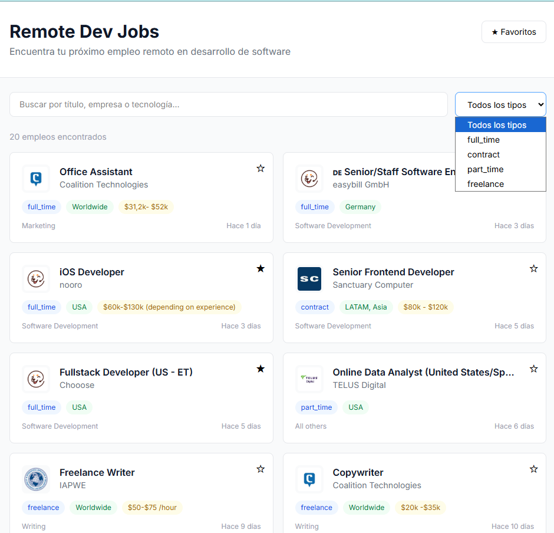

# Remote Dev Jobs — Job Board

Tablero de empleos remotos en desarrollo de software con búsqueda, filtros por tipo de trabajo y sistema de favoritos.



## Demo

[job-board-drab-chi.vercel.app](https://job-board-drab-chi.vercel.app)

## Características

- Listado de empleos remotos desde Remotive API con Server Side Rendering
- Búsqueda por título, empresa o tecnología
- Filtro por tipo de trabajo (full-time, contract, freelance)
- Página de detalle con descripción completa y link para aplicar
- Sistema de favoritos con persistencia en localStorage
- Diseño responsive con Tailwind CSS

## Stack tecnológico

**Framework:** Next.js 16 · TypeScript · App Router · Server Components
**Estilos:** Tailwind CSS v4
**API:** Remotive API (pública, sin key)
**Deploy:** Vercel

## Instalación local

### Prerrequisitos
- Node.js 18+

### Pasos

```bash
git clone https://github.com/Kevin30042001/job-board.git
cd job-board
npm install
npm run dev
```

Abrir `http://localhost:3000`

## Estructura del proyecto
job-board/
├── app/
│   ├── page.tsx                (listado con búsqueda)
│   ├── jobs/[id]/page.tsx      (detalle de empleo)
│   ├── favorites/page.tsx      (empleos guardados)
│   ├── layout.tsx
│   └── globals.css
├── components/
│   ├── JobCard.tsx
│   ├── JobSearch.tsx
│   ├── FavoritesContext.tsx
│   └── FavoritesList.tsx
├── lib/
│   └── api.ts
└── types/
└── job.ts

## Autor

**Kevin** — [@Kevin30042001](https://github.com/Kevin30042001)
